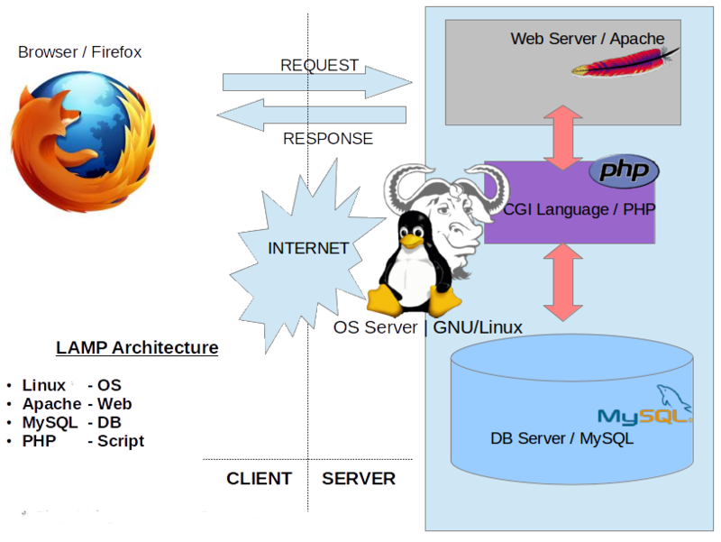

#  0x09. Web infrastructure design 

## DNS
- -------computer-----|-----DNS server------|----google----|
- | www.google.com  =>  www.google.com => google    | 
- | www.google.com  <=  192.123.23.23 <= 192.123.23.23"|
- ---------------------------------------------------------

 Common types of DNS records include:

- A Record (Address Record): Maps a domain name to an IPv4 address.

- AAAA Record (IPv6 Address Record): Maps a domain name to an IPv6 address.

- CNAME Record (Canonical Name Record): Creates an alias for a domain name, redirecting it to another domain.

- MX Record (Mail Exchange Record): Specifies the mail server responsible for receiving email on behalf of the domain.

- TXT Record (Text Record): Stores arbitrary text data, often used for verification purposes, SPF records, and other domain-related information.

- NS Record (Name Server Record): Specifies the authoritative DNS servers for the domain.

- PTR Record (Pointer Record): Maps an IP address to a domain name (reverse DNS lookup).

- SRV Record (Service Record): Specifies information about services available on the domain, such as SIP, XMPP, or LDAP.

- SOA Record (Start of Authority Record): Contains administrative information about the domain, including the primary DNS server, contact information, and other domain-related settings.

- Note:  DNS servers do not typically store IP addresses in their databases. but get it from authoritative DNS servers that store that connection

## Monitoring

- Tracking the performance and availability of (Systems, networks, applications)

## Web Server
- software serves web pages to browser http/https

## Load Balancer
- split the netwrok traffic into mulitple server to reduce the overwhelmed of just one server

## Server
- computer or software that provides services.
## LAMP
- Stand For  : Linux, Apache, MySQL, Perl/PHP/Python
- Design for :  open source software to build web applications

