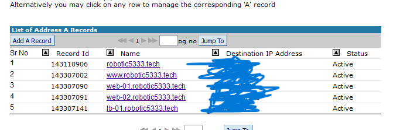

#  0x10. HTTPS SSL 
##  0. World wide web 
Configure your domain zone so that the subdomain www points to your load-balancer IP (lb-01). Let’s also add other subdomains to make our life easier, and write a Bash script that will display information about subdomains.
##  1. HAproxy SSL termination 
“Terminating SSL on HAproxy” means that HAproxy is configured to handle encrypted traffic, unencrypt it and pass it on to its destination.

Create a certificate using certbot and configure HAproxy to accept encrypted traffic for your subdomain www.


### Task 0
- Add the subdomain www to your domain, point it to your lb-01 IP (your domain name might be configured with default subdomains, feel free to remove them)
- Add the subdomain lb-01 to your domain, point it to your lb-01 IP
- Add the subdomain web-01 to your domain, point it to your web-01 IP
- Add the subdomain web-02 to your domain, point it to your web-02 IP
</img>

```bash
# To get DNS Query we use 
dig google.com
# pass argument.
info() {
    echo $1  $2
}
info "string1: $1 , string2: $2"
# 
```

### Task 1
```bash
sudo service haproxy stop
sudo apt update
sudo apt install snapd
sudo apt-get remove certbot
sudo apt-get install certbot
sudo certbot certonly --standalone --preferred-challenges http --http-01-port 80 -d www.example.com
sudo ls /etc/letsencrypt/live/your_domain_name
sudo mkdir -p /etc/haproxy/certs
DOMAIN='example.com' sudo -E bash -c 'cat /etc/letsencrypt/live/$DOMAIN/fullchain.pem /etc/letsencrypt/live/$DOMAIN/privkey.pem > /etc/haproxy/certs/$DOMAIN.pem'
sudo chmod -R go-rwx /etc/haproxy/certs
sudo nano /etc/haproxy/haproxy.cfg
```

### Task 3
- The same as the previous one.