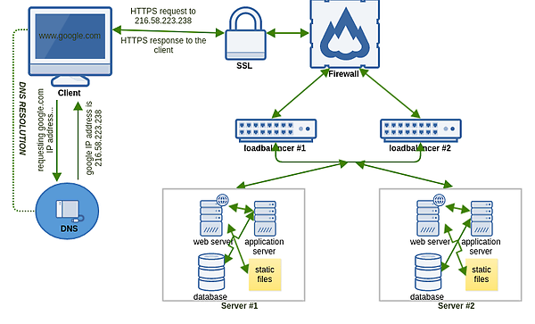

# What happens when you type `https://www.google.com` in your browser and press Enter?


# DNS request : port 53
first browser need to resolve the domain name to the ip addresss by sending DNS query to the DNS server.
- you can see the dns resulted ip by using nslookup
```bash
nslookup www.google.com
```

# Firewall
firewall controls the incoming and outgoing traffic by predetermind security rules
- to scan for open ports and detect firewall rules
```bash
# Test TCP SYN Scan
sudo nmap -sS -p 80,443 www.google.com
# Test TCP ACK scan 
sudo nmap -sA -p 80,443 www.google.com
# Test window Scan 
sudo nmap -sW -p 80,443 www.google.com
# Test ip Protocal Scan
sudo nmap -sO www.google.com
```
# HTTPS/SSL
HTTPs ensures secure communication over the internet SSL/TLS which is in port 443 and accessed by https://www.google.com instead of request a http//ww.google.com 
# Load-balancer
a Load balancer distributes network or application traffic across multiple servers.
- to see how much the server have
```bash
sudo apt install apache2-utils
# Runs the Apache Benchmark command with 100 requests and a concurrency of 10.
 Runs the Apache Benchmark command with 100 requests and a concurrency of 10.
 ab -n 100 -c 10 https://www.google.com/ | grep -E "Complete requests|Failed requests|Total transferred|HTML transferred|Requests per second|Time per request|Transfer rate"
```
# Web server
- handles http requests and serves web content
- the content of the url.
```bash
http://www.google.com

```
# Application server
- runs server-side applications and processes business logic
```bash
curl -v http://your-app-server/api/endpoint
```
# Database
- The database stores and retrives data for the application.
