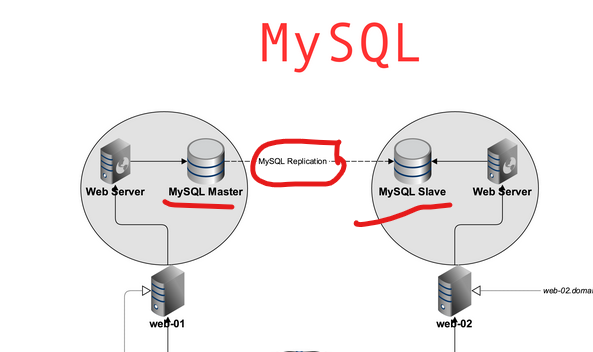

# 0x14. MySQL 

## General
- What is a database replica
A database replica is a copy of a database that is maintained on a different server or location to mirror the original database.
- What is the purpose of a database replica
The purpose of a database replica is to improve data availability, enhance performance, and provide redundancy for disaster recovery.
- Why database backups need to be stored in different physical locations
Database backups need to be stored in different physical locations to ensure data safety and availability in case of hardware failures, natural disasters, or other catastrophic events affecting the primary location.
## Tasks

- The primary database is in web-01 (mysql Master) and the replica must be in the web-02 (mysql Slave)
## different between Replication slave , Replication client
- REPLICATION SLAVE: Needed to set up and manage slave servers, allowing access to binary logs and replication commands.
- REPLICATION CLIENT: Used for monitoring replication status and logs without the ability to alter replication settings.
```sql
CREATE USER 'replica_user'@'%' IDENTIFIED BY 'replica_password';
GRANT REPLICATION SLAVE ON *.* TO 'replica_user'@'%';
/*++++++++++++++++++++++++++++++++++++++++++++++++*/
CREATE USER 'monitor_user'@'localhost' IDENTIFIED BY 'monitor_password';
GRANT REPLICATION CLIENT ON *.* TO 'monitor_user'@'localhost';

```
1. create database and table with one value and grant privilege to the new user.

2. make the slave username have the replication privilege. 
```sql
GRANT REPLICATION SLAVE  ON *.* TO '$replica_user'@'%';
```
3. Go to web-01, web-02 and config the mysql to create a bin for the specfic database execute : (task_4_master.sh on web-01, task_4_salve.sh on web-02). then connect web-02 with the web-01 by executeing the : (task_4_create_user.sh on web-02) and update the data with what you want.
