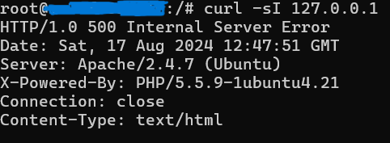
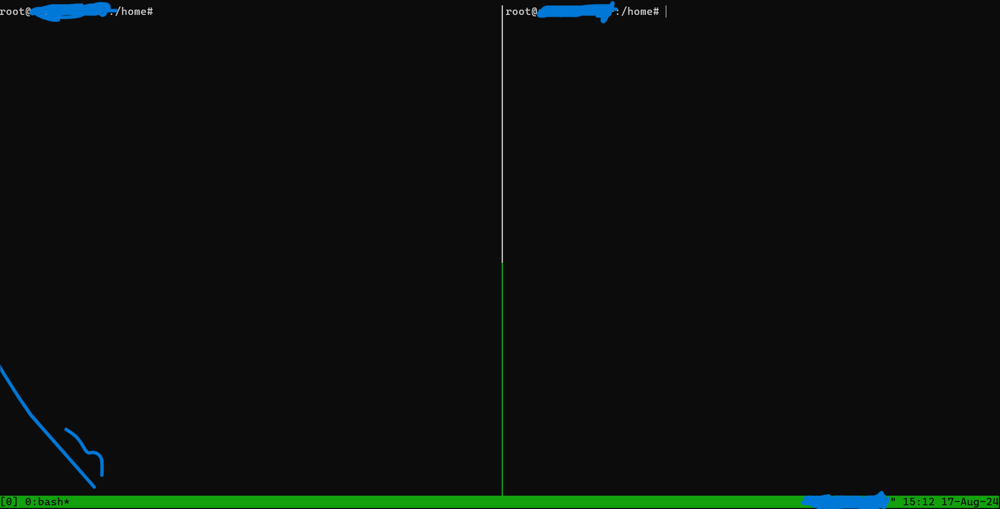
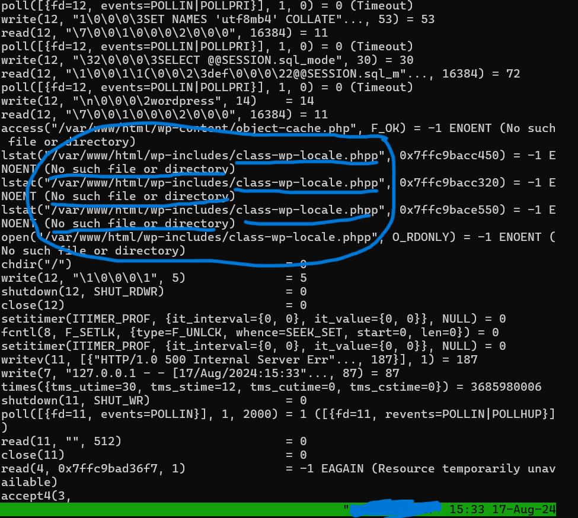
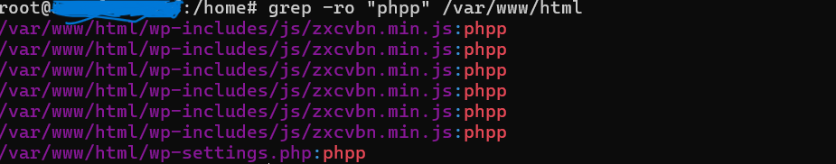
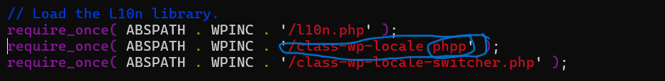

# Postmortem : Reports
## Summary
On our wordpress website there is was internal Server Error that down the server.



- Duration of the outage: Aug 12, 2024 6:00 AM - Aug 19, 2024 6:00 AM
- The impact: down the hole services , The user was experiencing 500 internal error code.

## Timeline
- 15/08 - the issue was detected at 15/08, the issue detected by curling the prime server ip address, we assumped that the apaches server that running the wordpress website have a problem, The incident was resolved by  watch how the program interacts with the system using strace command. 
## Root casue
- to resolve the problem first we use the tmux command to have splited windows for better caputring the problem by eyes. 

- then we search the process that running the apache services.
```bash
ps -aux | grep apache
```
- then we copy the pid and see how the system react to the user geting the services
```bash
# in window one 
sudo strace -p <pid>
# in the other window
curl -sI 127.0.0.1
```



### As we see we get on a file not found `class-wp-locale.phpp` and that's a wrong php extension 

- then we need to search where this file initlized


- Searching each file for the file name `class-wp-locale.phpp`


## Corrective and preventative measures must contain
- We most create todo list for similer failure , for this problem the problem can be listed as todo format as this:-
    -   checking each file extensions
    -   correct it if it's wrong